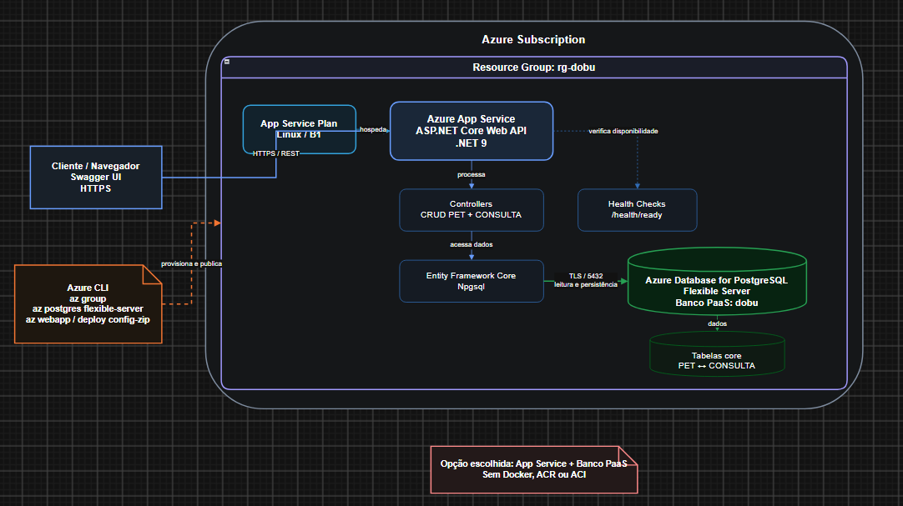

# Dobu - Plataforma de cuidado veterinário

API REST em ASP.NET Core para gerenciamento de informações do cuidado veterinário. Esta entrega foi preparada para a **3ª Sprint de DevOps Tools & Cloud Computing**, utilizando exclusivamente a **Opção 2: Azure App Service + Banco de Dados PaaS**.

> **Decisão de arquitetura da entrega:** aplicação no Azure App Service e banco no Azure Database for PostgreSQL Flexible Server. **Não são usados Docker, Azure Container Registry (ACR) ou Azure Container Instances (ACI).**

---

## 1. Descrição da solução

A Dobu centraliza o acompanhamento veterinário de animais em uma API REST. A aplicação permite administrar pets, responsáveis, veterinários, consultas, agendamentos, prontuários, vacinas, pagamentos, lembretes e demais informações relacionadas ao cuidado animal.

Para a demonstração obrigatória desta Sprint, o CRUD é evidenciado nas tabelas **PET** e **CONSULTA**, que pertencem ao CORE do domínio e são relacionadas entre si: cada consulta possui uma chave estrangeira para o pet atendido.

A API possui Swagger/OpenAPI para execução visual dos endpoints e utiliza Entity Framework Core com Npgsql para persistir os dados no PostgreSQL da Azure.

## 2. Benefícios para o negócio

A solução reduz a dispersão de informações clínicas e operacionais, concentrando o histórico do animal e seus atendimentos em uma única base. Isso facilita a consulta do histórico do pet, o acompanhamento de consultas e cuidados e a evolução futura da plataforma para aplicações web/mobile que consumam a mesma API.

A hospedagem em Azure App Service também remove a necessidade de manter servidor próprio para a API, enquanto o PostgreSQL Flexible Server oferece um banco PaaS administrado pela Azure.

---

## 3. Arquitetura cloud da solução

O desenho abaixo representa os **recursos de nuvem e seus limites**, e não um fluxograma de processo, UML ou TOGAF.



### Componentes

- **Azure Subscription / Resource Group `rg-dobu`:** limite dos recursos da entrega.
- **App Service Plan Linux B1:** capacidade computacional que hospeda o App Service.
- **Azure App Service:** executa a API ASP.NET Core em .NET 9.
- **App Settings:** armazenam `Database__Provider`, string de conexão e chave JWT sem versioná-las no GitHub.
- **Azure Database for PostgreSQL Flexible Server:** banco PaaS PostgreSQL 16.
- **Azure CLI:** provisiona Resource Group, banco, plano, App Service, firewall e configurações.
- **Swagger/cliente:** acessa a API por HTTPS.
- **Entity Framework Core/Npgsql:** camada de acesso do App Service ao PostgreSQL usando TLS/porta 5432.

A regra PostgreSQL `0.0.0.0` é usada para permitir conexões originadas de serviços da Azure. Para a demonstração local com `psql`, o README orienta a criação via CLI de uma regra adicional limitada ao IP público do apresentador.

---

## 4. Tecnologias

- .NET 9 / ASP.NET Core Web API
- Entity Framework Core 9
- Npgsql
- PostgreSQL 16
- Azure App Service
- Azure Database for PostgreSQL Flexible Server
- Azure CLI
- Swagger/OpenAPI
- xUnit
- Serilog / OpenTelemetry / Health Checks

Estrutura da solução:

```text
DOBU/
├── Dobu.Domain/
├── Dobu.Application/
├── Dobu.Infrastructure/
├── Dobu.Api/
└── tests/
```

---

## 5. Estrutura da entrega

```text
/
├── DOBU/                              # código-fonte .NET
├── azure/
│   ├── deploy-appservice.sh           # provisionamento dos recursos por Azure CLI
│   └── deploy-code.sh                 # build + deploy do código por Azure CLI
├── docs/
│   └── arquitetura.png
├── script_bd.sql                      # DDL, comentários e seeds
├── ENTREGA.pdf                        
└── README.md
```

---

## 6. Banco de dados obrigatório

O banco da entrega é **Azure Database for PostgreSQL Flexible Server**, serviço PaaS na nuvem. H2 não é utilizado e o banco da entrega não é containerizado.

O arquivo `script_bd.sql` contém:

- tabelas e colunas;
- chaves primárias UUID;
- chaves estrangeiras;
- restrições;
- comentários SQL (`COMMENT ON TABLE` / `COMMENT ON COLUMN`);
- pelo menos duas linhas significativas em `PET`;
- pelo menos duas linhas significativas em `CONSULTA`.

### Relação CORE 

```text
PET (ID_PET_PK)
       1
       |
       | FK CONSULTA.ID_PET_FK
       N
CONSULTA (ID_CONSULTA_PK)
```

Os IDs fixos dos dados de demonstração são:

```text
Raça Golden Retriever : 22222222-2222-2222-2222-222222222222
Veterinária Ana        : 33333333-3333-3333-3333-333333333333
Responsável Carlos     : 44444444-4444-4444-4444-444444444444
Pet Luna               : 55555555-5555-5555-5555-555555555555
Pet Thor               : 66666666-6666-6666-6666-666666666666
Consulta Luna          : 77777777-7777-7777-7777-777777777777
Consulta Thor          : 88888888-8888-8888-8888-888888888888
```

---

# 7. HOW TO
## 7.1 Clonar o repositório

```bash
git clone https://github.com/DobuChallenge/Dobu-Devops.git
cd Dobu-Devops
```

## 7.2 Pré-requisitos
- Git;
- .NET 9 SDK;
- Azure CLI;
- `psql` (cliente PostgreSQL);
- `zip`;
- `curl`.

Confirme:

```bash
git --version
dotnet --version
az version
psql --version
zip -v | head -n 2
```

## 7.3 Login na Azure

```bash
az login
az account set --subscription "<SUBSCRIPTION_ID>"
az account show --output table
```

## 7.4 Definir o IP que fará os SELECTs

`0.0.0.0` no Flexible Server permite acesso a partir de recursos Azure, mas não libera automaticamente o computador local. Para que o `psql` da gravação funcione, obtenha seu IP público e deixe-o em `CLIENT_IP`:

```bash
export CLIENT_IP="$(curl -s https://api.ipify.org)"
echo "$CLIENT_IP"
```

## 7.5 Criar TODOS os recursos Azure via CLI

Escolha um nome global único, somente com letras minúsculas, números e hífens. Exemplo: `dobu-sprint3-grupo01`.

```bash
chmod +x azure/deploy-appservice.sh azure/deploy-code.sh

./azure/deploy-appservice.sh \
  rg-dobu \
  brazilsouth \
  dobu-sprint3-grupo01 \
  dobuadmin
```

O script solicitará duas informações sem mostrá-las no terminal:

1. senha forte do PostgreSQL;
2. chave JWT com pelo menos 32 caracteres.

O script cria via Azure CLI:

1. Resource Group;
2. PostgreSQL Flexible Server 16;
3. banco `dobu`;
4. regra de firewall para `CLIENT_IP`;
5. App Service Plan Linux B1;
6. App Service .NET 9;
7. App Settings com PostgreSQL/JWT;
8. HTTPS-only, TLS 1.2 e HTTP/2.

## 7.6 Mostrar os recursos criados via CLI

```bash
az group show --name rg-dobu --output table

az appservice plan show \
  --resource-group rg-dobu \
  --name dobu-sprint3-grupo01-plan \
  --output table

az webapp show \
  --resource-group rg-dobu \
  --name dobu-sprint3-grupo01 \
  --output table

az postgres flexible-server show \
  --resource-group rg-dobu \
  --name dobu-sprint3-grupo01-pg \
  --output table

az postgres flexible-server db list \
  --resource-group rg-dobu \
  --server-name dobu-sprint3-grupo01-pg \
  --output table

az postgres flexible-server firewall-rule list \
  --resource-group rg-dobu \
  --name dobu-sprint3-grupo01-pg \
  --output table
```

## 7.7 Criar as tabelas e seeds no banco da Azure
```bash
read -r -s -p "Senha PostgreSQL: " PGPASSWORD; export PGPASSWORD; echo

psql \
  "host=dobu-sprint3-grupo01-pg.postgres.database.azure.com port=5432 dbname=dobu user=dobuadmin sslmode=require" \
  -f script_bd.sql
```

```sql
SELECT ID_PET_PK, NOME_PET, NUMERO_IDADE, ID_RACA_FK, ID_RESPONSAVEL_FK
FROM PET
ORDER BY NOME_PET;

SELECT ID_CONSULTA_PK, DATA_CONSULTA, DESC_CONSULTA, VALOR_CONSULTA, ID_PET_FK
FROM CONSULTA
ORDER BY DATA_CONSULTA;
```

```bash
unset PGPASSWORD
```

## 7.8 Publicar a API no App Service

```bash
./azure/deploy-code.sh rg-dobu dobu-sprint3-grupo01
```

O script executa `dotnet publish`, compacta somente os arquivos publicados e usa `az webapp deploy`.

Valide os endpoints públicos:

```text
https://dobu-sprint3-grupo01.azurewebsites.net/swagger
https://dobu-sprint3-grupo01.azurewebsites.net/health
https://dobu-sprint3-grupo01.azurewebsites.net/health/ready
```
---

# 8. Swagger - autenticação necessária para PET

O controller de `PET` é protegido por JWT. Antes do CRUD, crie um usuário de demonstração pelo Swagger.

## POST `/api/auth/register`

```json
{
  "nome": "Operador da Demonstracao",
  "email": "operador.sprint3@dobu.com",
  "senha": "SenhaDemo123!",
  "tipoUsuario": "Responsavel"
}
```

Copie o valor retornado em `token`. No botão **Authorize** do Swagger, informe:

```text
Bearer <TOKEN_RETORNADO>
```
---

# 9. Demonstração do CRUD + SELECT no banco

```bash
read -r -s -p "Senha PostgreSQL: " PGPASSWORD; export PGPASSWORD; echo

psql "host=dobu-sprint3-grupo01-pg.postgres.database.azure.com port=5432 dbname=dobu user=dobuadmin sslmode=require"
```

## 9.1 CRUD da tabela PET

```json
{
  "nome": "Nina Sprint3",
  "idade": 2,
  "racaId": "22222222-2222-2222-2222-222222222222",
  "responsavelId": "44444444-4444-4444-4444-444444444444"
}
```

```sql
SELECT ID_PET_PK, NOME_PET, NUMERO_IDADE, ID_RACA_FK, ID_RESPONSAVEL_FK
FROM PET
WHERE NOME_PET = 'Nina Sprint3';
```

### B. Consulta - GET `/api/pets/<ID_NINA>`

```sql
SELECT ID_PET_PK, NOME_PET, NUMERO_IDADE
FROM PET
WHERE ID_PET_PK = '<ID_NINA>';
```

### C. Alteração - PUT `/api/pets/<ID_NINA>`

```json
{
  "nome": "Nina Sprint3 Atualizada",
  "idade": 3,
  "racaId": "22222222-2222-2222-2222-222222222222",
  "responsavelId": "44444444-4444-4444-4444-444444444444"
}
```

```sql
SELECT ID_PET_PK, NOME_PET, NUMERO_IDADE
FROM PET
WHERE ID_PET_PK = '<ID_NINA>';
```

## 9.2 CRUD da tabela CONSULTA relacionada ao PET

### A. Inclusão - POST `/api/consultas`

```json
{
  "dataConsulta": "2026-09-15T14:00:00Z",
  "descricao": "Consulta Sprint 3",
  "valor": 195.50,
  "petId": "<ID_NINA>",
  "veterinarioId": "33333333-3333-3333-3333-333333333333"
}
```

```sql
SELECT ID_CONSULTA_PK, DATA_CONSULTA, DESC_CONSULTA, VALOR_CONSULTA, ID_PET_FK
FROM CONSULTA
WHERE ID_CONSULTA_PK = '<ID_CONSULTA_NINA>';
```

```sql
SELECT
    P.ID_PET_PK,
    P.NOME_PET,
    C.ID_CONSULTA_PK,
    C.DESC_CONSULTA,
    C.VALOR_CONSULTA
FROM PET P
JOIN CONSULTA C ON C.ID_PET_FK = P.ID_PET_PK
WHERE P.ID_PET_PK = '<ID_NINA>';
```

### B. Consulta - GET `/api/consultas/<ID_CONSULTA_NINA>`

```sql
SELECT ID_CONSULTA_PK, DESC_CONSULTA, VALOR_CONSULTA
FROM CONSULTA
WHERE ID_CONSULTA_PK = '<ID_CONSULTA_NINA>';
```

### C. Alteração - PUT `/api/consultas/<ID_CONSULTA_NINA>`
{
  "dataConsulta": "2026-09-16T16:30:00Z",
  "descricao": "Consulta Sprint 3 atualizada e confirmada",
  "valor": 210.00,
  "petId": "<ID_NINA>",
  "veterinarioId": "33333333-3333-3333-3333-333333333333"
}
```


```sql
SELECT ID_CONSULTA_PK, DATA_CONSULTA, DESC_CONSULTA, VALOR_CONSULTA
FROM CONSULTA
WHERE ID_CONSULTA_PK = '<ID_CONSULTA_NINA>';
```

### D. Exclusão - DELETE `/api/consultas/<ID_CONSULTA_NINA>`

```sql
SELECT ID_CONSULTA_PK, DESC_CONSULTA
FROM CONSULTA
WHERE ID_CONSULTA_PK = '<ID_CONSULTA_NINA>';
```
## 9.3 Finalizar a exclusão do PET

```sql
SELECT ID_PET_PK, NOME_PET
FROM PET
WHERE ID_PET_PK = '<ID_NINA>';
```

O SELECT deve retornar **0 linhas**.

Ao terminar:

```bash
unset PGPASSWORD
```
------------------------------------------------------------------